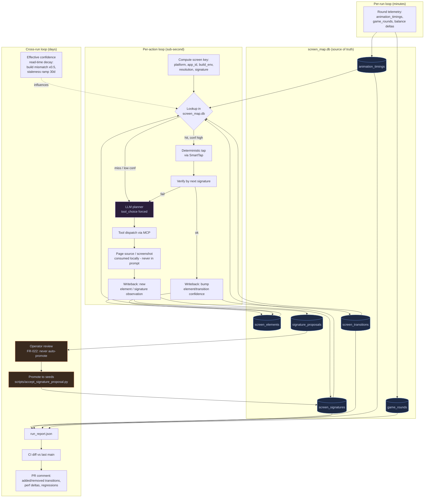

# Self-improving loop

How the casino agent gets cheaper, faster, and more accurate every run. Three nested cycles: per-action (map-first), per-run (telemetry → DB), and cross-run (operator-gated promotion + report diff).

## High-level (the three cycles)

```
                ┌──────────────────────── CROSS-RUN (days) ─────────────────────────┐
                │                                                                    │
                │   run_report.json  ─▶  CI diff vs last main  ─▶  PR comment        │
                │          ▲                                          │              │
                │          │                                          ▼              │
                │   signature_proposals ─▶ operator review ─▶ accepted seeds         │
                │                                                    │               │
                └────────────────────────────────────────────────────┼───────────────┘
                                                                     │ writes
                ┌──────────────────────── PER-RUN (minutes) ─────────┼───────────────┐
                │                                                    ▼               │
                │   AgentGoalWorkflow                          screen_map.db         │
                │     │                                       ┌──────────────────┐   │
                │     │  active_intent each turn              │ screen_signatures │   │
                │     ▼                                       │ screen_elements   │   │
                │   planner (tool-use forced) ──┐             │ screen_transitions│   │
                │                               │             │ animation_timings │   │
                │   ┌─────── PER-ACTION (sub-second) ─────────│ game_rounds       │   │
                │   │                           │             │ signature_proposals│  │
                │   │  map-first lookup ◀───────┘             │                   │   │
                │   │      │                                  └──────────────────┘   │
                │   │      ▼                                          ▲              │
                │   │  hit?  ──yes──▶ deterministic tap ──▶ verify ───┤ writeback    │
                │   │   │                                              │              │
                │   │  no                                              │              │
                │   │   ▼                                              │              │
                │   │  LLM/visual fallback ──▶ propose new signature ──┘              │
                │   └─────────────────────────────────────────────────────────────────┘
                │                                                                    │
                └────────────────────────────────────────────────────────────────────┘
```

The inner loop is what eliminates LLM cost on stable flows. The middle loop captures fresh learning. The outer loop validates and promotes it.

## Detailed flow (Mermaid)



## What each cycle optimizes

| Cycle | Latency | What it learns | What it costs | What it saves |
|---|---|---|---|---|
| Per-action | sub-second | element coords, signature hits, transition confidence | one DB read | one LLM call per known step |
| Per-run | minutes | new signatures, new transitions, animation timings, round outcomes, failure modes | one DB write per step | future LLM calls + future fixed-wait padding |
| Cross-run | days | which proposals are real, which builds regressed, which timings drifted | operator minutes | bad data poisoning the inner loops |

## Decay and safety

- **Effective confidence** (`shared/screen_graph._effective_confidence`) applies read-time decay so stale rows can't tyrannize the inner loop:
  - build_env mismatch → ×0.5
  - linear staleness ramp past `SCREEN_MAP_STALENESS_DAYS` (default 30)
  - stored confidence is **never** destructively modified — only effective confidence at read time
- **Operator gate** on every promotion (FR-022). Auto-promotion is forbidden — a bad signature would wedge every future run.
- **Single-failure reset** on graduated rows: one miss on a HIGH-tier row resets confidence to force re-verification.
- **Self-heal first**: on miss, try alternative selector strategies before falling back to LLM; on repeated failure, save evidence and continue or stop per policy — never `next='question'` for routine recovery.

## Where new things plug in (no code fork)

- New **screen** → row in `screen_signatures` (proposed → accepted).
- New **element** → row in `screen_elements` with caller-supplied coords (auto-recorder).
- New **multi-step recipe** (search a lobby, dismiss a permission stack) → seeded rows in `screen_transitions`; the path planner finds them automatically. No separate "skill" primitive.
- New **game** → row in `game_directory` (auto-discovered from lobby-walk or ops seed); the `game_playbook` row auto-fills on first launch. New game *family* → new `game_kinds/<kind>.md` (rare).
- New **animation timing** → online update of `animation_timings` (mean, stddev, p95).
- New **failure mode** → row in `recovery_json` per game; surfaced in next report.

The Python codebase is unchanged for any of the above. Code only changes when a new platform driver, a new tool primitive, or a new intent is needed.

## Steady-state economics

After N runs of a stable flow, every step on the path has high effective confidence and DB hits — the planner is bypassed entirely on those steps (replay mode). The 23-turn login becomes ~0 LLM turns; per-spin cost on a known game collapses to one map lookup + one verified tap + one balance read. Novelty is the only thing that pays for the LLM. Decay + operator gating keep the steady state honest.
